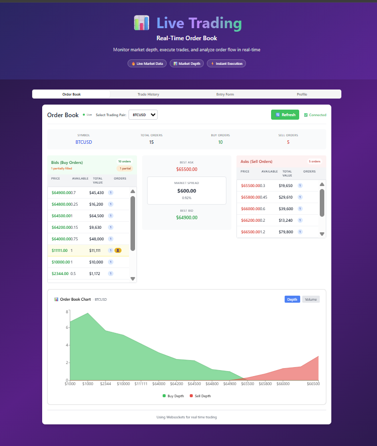
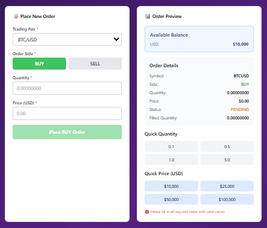
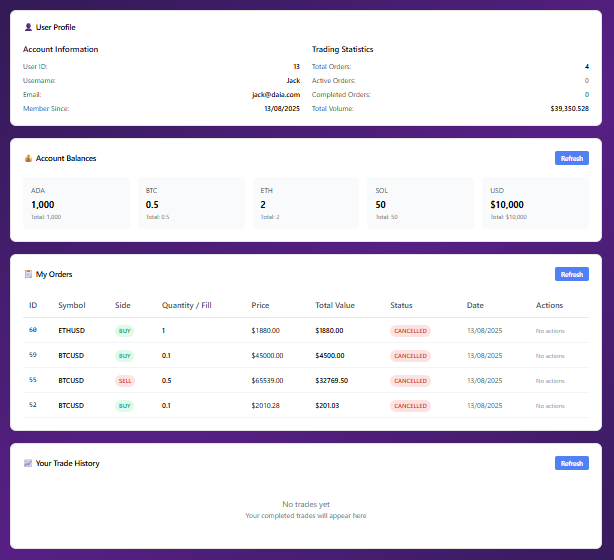

# 📈 Real-Time Order Book Platform

> A financial order book system designed for investment bank front offices, featuring real-time WebSocket updates, order management, and trade execution.

## ✨ Features

- 🔄 **Real-time order book updates** via WebSocket connections
- 📊 **Interactive trading interface** with buy/sell order placement
- � **Secure authentication system** with JWT tokens and encrypted passwords
- 👤 **Session management** with automatic token expiry (1 hour)
- 💰 **Portfolio management** with balance tracking
- 📈 **Live market data** and price level visualization
- ⚡ **Fast order execution** with instant feedback
- 📱 **Responsive design** for desktop and mobile
- 🛡️ **Data protection** with secure token storage and validation

## 🎯 Screenshots

### Main Trading Interface

<!-- Add screenshot of the main orderbook interface here -->



### Order Placement

<!-- Add screenshot of order placement form here -->



### Portfolio View

<!-- Add screenshot of user portfolio/profile view here -->



## 🏗️ Architecture

```
├── 🗄️ Database (MySQL)     - Order and user data storage
├── 🔧 Backend (Flask)      - REST API + WebSocket server
├── ⚛️ Frontend (React)     - Interactive trading interface
└── 🌐 Real-time Updates    - WebSocket connections
```

## 🔐 Security Features

### 🛡️ Authentication & Authorization

- **JWT (JSON Web Tokens)** for stateless authentication
- **Bcrypt password hashing** - passwords are never stored in plain text
- **Token-based sessions** with configurable expiry (default: 1 hour)
- **Automatic logout** on token expiration for security

### 🔒 Data Protection

- **Secure token storage** in browser's localStorage
- **CORS protection** configured for allowed origins only
- **Input validation** on both frontend and backend
- **SQL injection prevention** with parameterized queries

### ⏰ Session Management

- **Automatic token refresh** prompts before expiration
- **Secure logout** with token cleanup
- **Session persistence** across browser refreshes
- **Multi-device support** with independent token management

```bash
# Token Configuration (backend/.env)
JWT_ACCESS_TOKEN_EXPIRES=1h    # Token validity period
JWT_SECRET=your_secret_key     # Strong secret for token signing
```

## 🎯 Goal

Build a robust, scalable, and customizable orderbook solution that serves as:

- **Primary**: A trading platform for front office teams at investment banks
- **Secondary**: A flexible foundation for developers building custom trading tools and analytics
- **Future**: AI-driven trading analytics and advanced market insights

## 🚀 Quick Start

Follow these steps to get the platform running locally.

### 📋 Prerequisites

- **Python 3.8+** for the backend
- **Node.js 16+** for the frontend
- **MySQL 8.0+** for the database
- **Git** for version control

---

## 🛠️ Installation

### 1. 🗄️ Database Setup

Create the database using the schema file:

```bash
# Connect to MySQL and run the schema
mysql -u your_username -p < database/orderbook-schema.sql

# Optional: Load sample data
mysql -u your_username -p < database/dummy_data.sql
```

### 2. ⚙️ Backend Setup

1. **Create environment file** in `/backend` directory:

   ```bash
   # backend/.env
   JWT_SECRET=your_super_secret_jwt_key_here
   DB_USER=your_mysql_username
   DB_PASSWORD=your_mysql_password
   DB_HOST=localhost
   DB_NAME=orderbook_db
   ```

2. **Install Python dependencies**:

   ```bash
   cd backend
   python -m venv .venv

   # Activate virtual environment
   # Windows:
   .venv\Scripts\activate
   # macOS/Linux:
   source .venv/bin/activate

   pip install -r requirements.txt
   ```

3. **Start the backend server**:
   ```bash
   python api.py
   ```
   ✅ Backend will run on `http://localhost:5000`

### 3. 🎨 Frontend Setup

1. **Install Node.js dependencies**:

   ```bash
   cd frontend/orderbook
   npm install
   ```

2. **Start the development server**:
   ```bash
   npm run dev
   ```
   ✅ Frontend will run on `http://localhost:5173`

---

## 🎮 Usage

1. **Open your browser** to `http://localhost:5173`
2. **Register a new account** or login with existing credentials
3. **Place orders** using the trading interface
4. **Monitor real-time updates** as orders are matched and executed
5. **View your portfolio** and transaction history

## 🧪 API Documentation

### 🔐 Authentication Endpoints

```
POST /register - Create new user account
               ├── Email validation & uniqueness check
               ├── Password encryption with bcrypt
               └── Returns success confirmation

POST /login    - Login user and get JWT token
               ├── Credential validation
               ├── Password verification
               └── Returns JWT token + user info + expiry time
```

### 📊 Order Management (🔒 Auth Required)

```
GET    /orders           - Get all active orders (with ownership flags)
POST   /orders           - Place a new order
DELETE /orders/{id}      - Cancel an order (own orders only)
PUT    /orders/{id}      - Update an order (own orders only)
```

### 👤 User & Portfolio (🔒 Auth Required)

```
GET /user/orders       - Get user's orders and order history
GET /user/balances     - Get user's current balances
GET /user/transactions - Get transaction history
PUT /user/balance      - Update user balance (admin/trading)
```

### 🔑 Authentication Headers

All protected endpoints require:

```bash
Authorization: Bearer <jwt_token>
Content-Type: application/json
```

### 📡 WebSocket Events

```
connect          - Establish real-time connection
subscribe_orderbook - Subscribe to orderbook updates
orderbook_update    - Receive real-time order changes
disconnect          - Clean connection termination
```

## 🤝 Contributing

1. Fork the repository
2. Create a feature branch (`git checkout -b feature/amazing-feature`)
3. Commit your changes (`git commit -m 'Add amazing feature'`)
4. Push to the branch (`git push origin feature/amazing-feature`)
5. Open a Pull Request

## 📝 License

This project is licensed under the MIT License - see the [LICENSE](LICENSE) file for details.
